# Supply Chain Management System

Backend: Node.js | Frontend: React

## Features

### • Dashboard
 
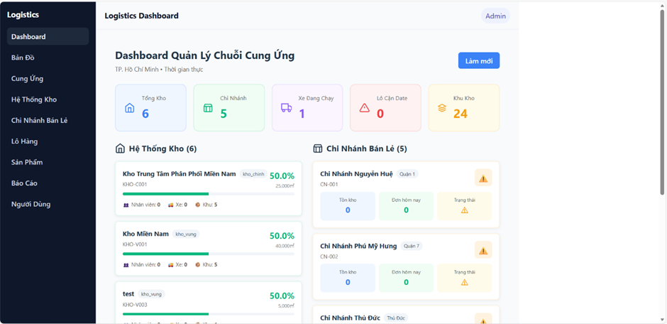

### • Warehouse and Inventory Management
 
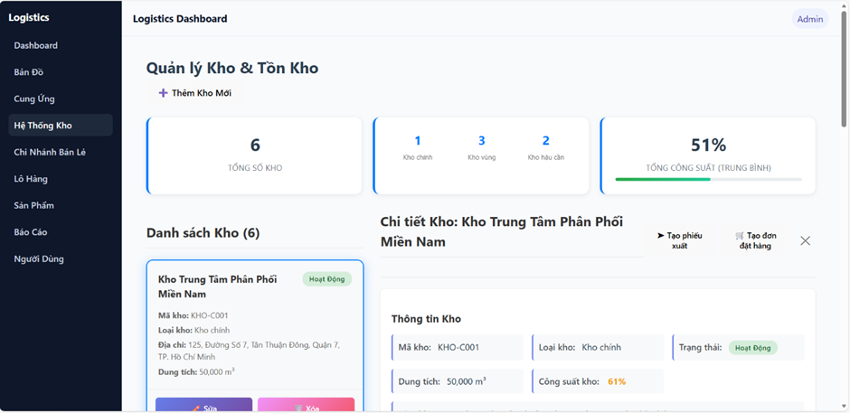

### Warehouse Details
 
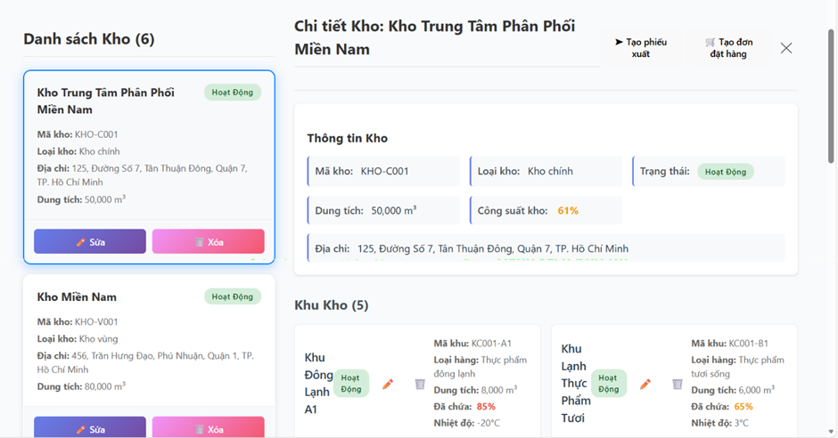
 
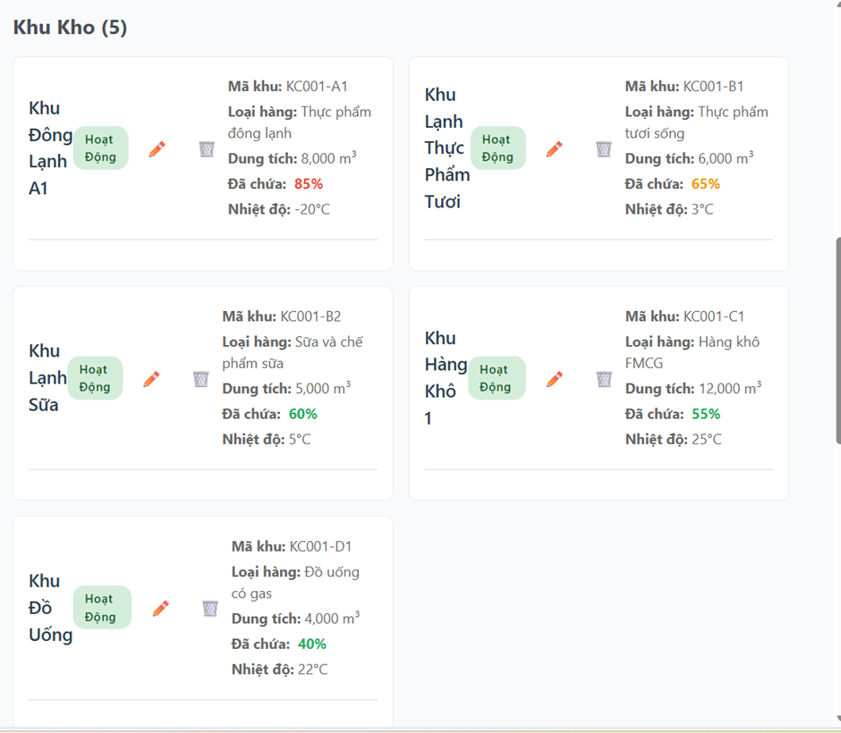

### Inventory Management
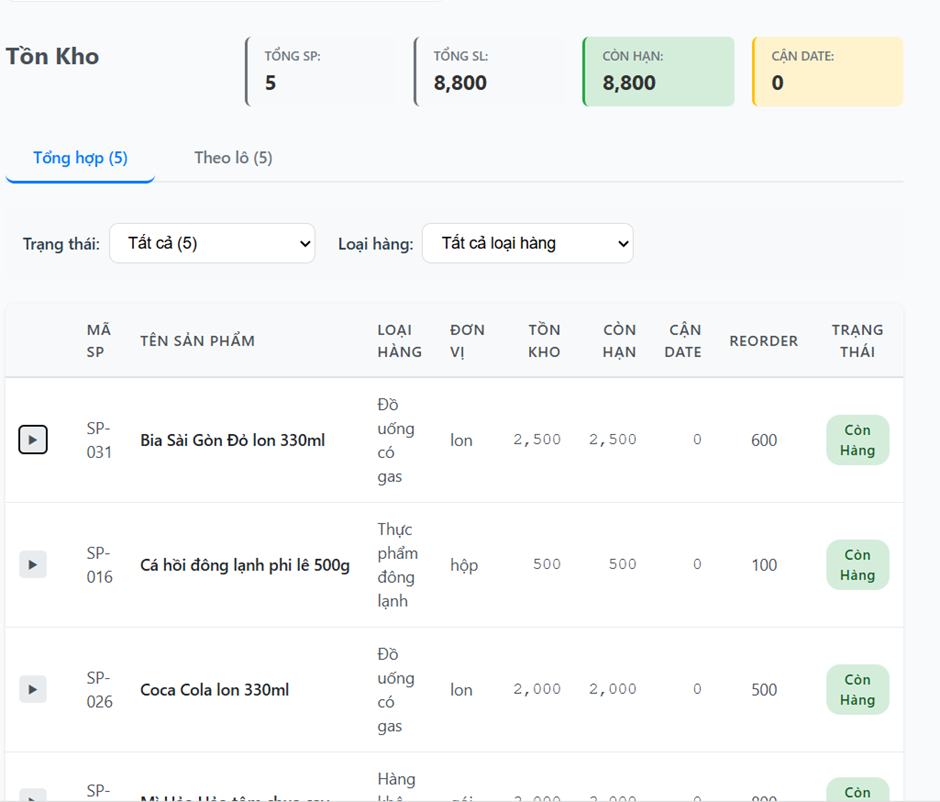

### Storage Requirements
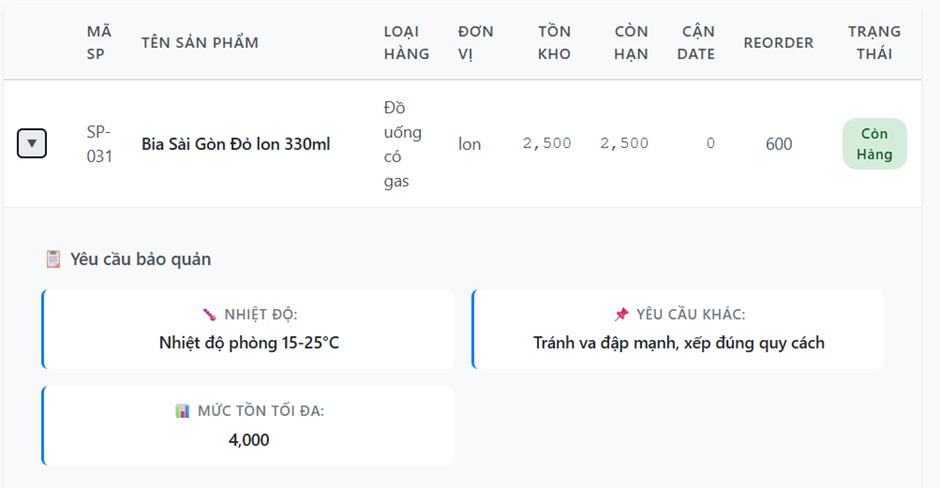

### Add New Warehouse
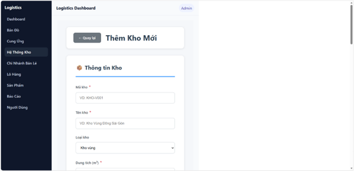
 
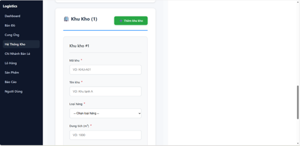

### Create Export Receipt
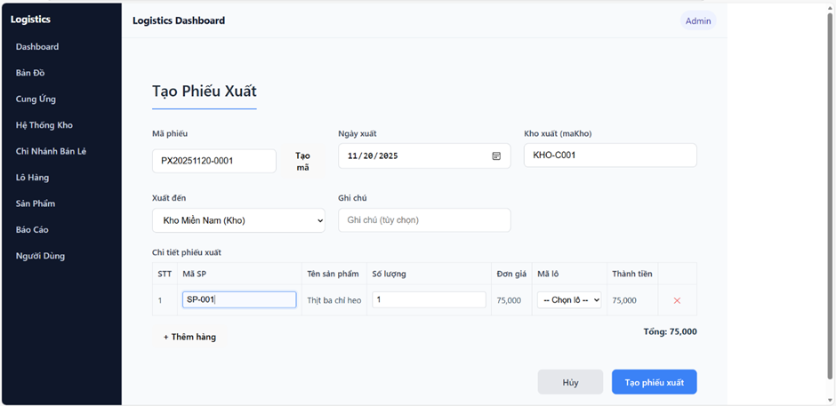

### Create Purchase Order
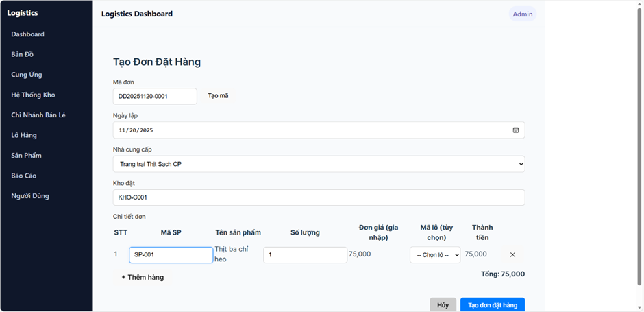

### Product Order Not Belonging to Supplier
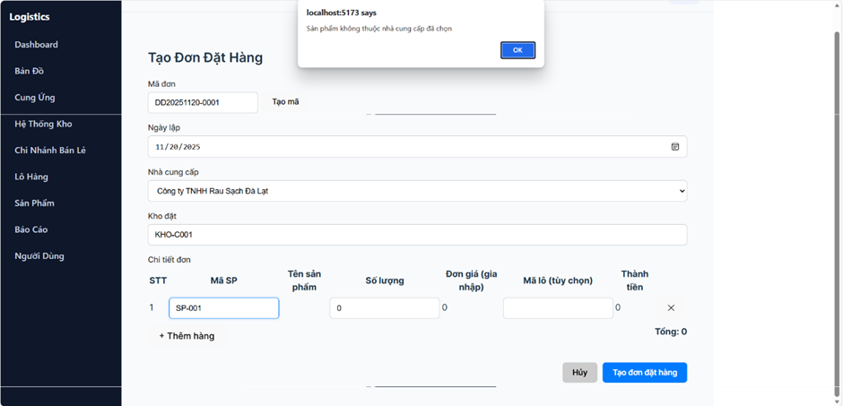

### Branch Management
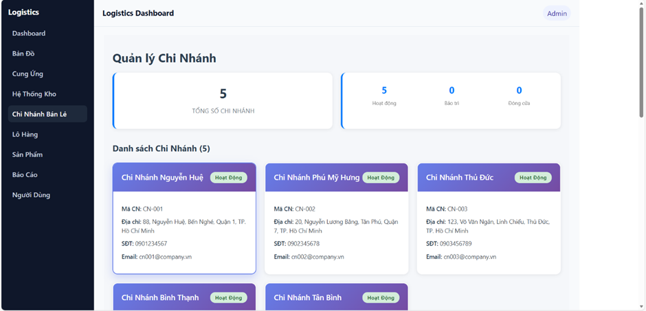

### Branch Details - Inventory
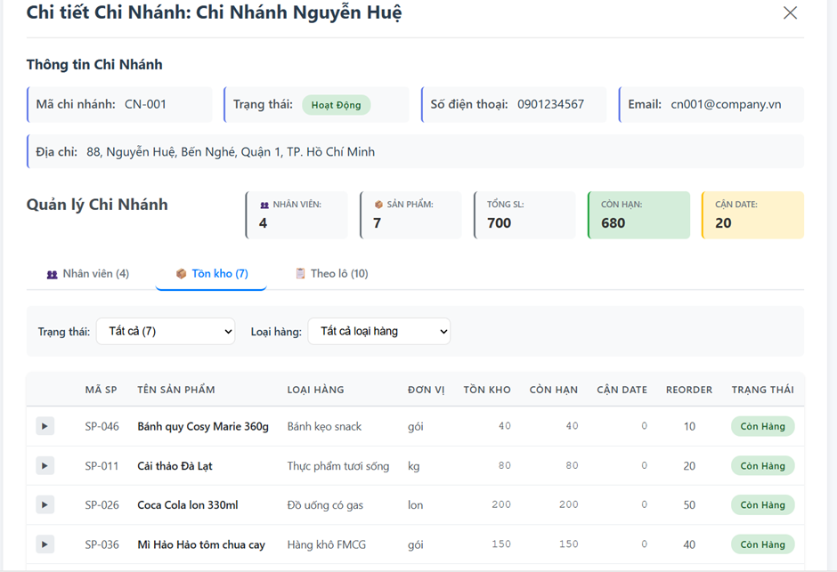

### Employee Management
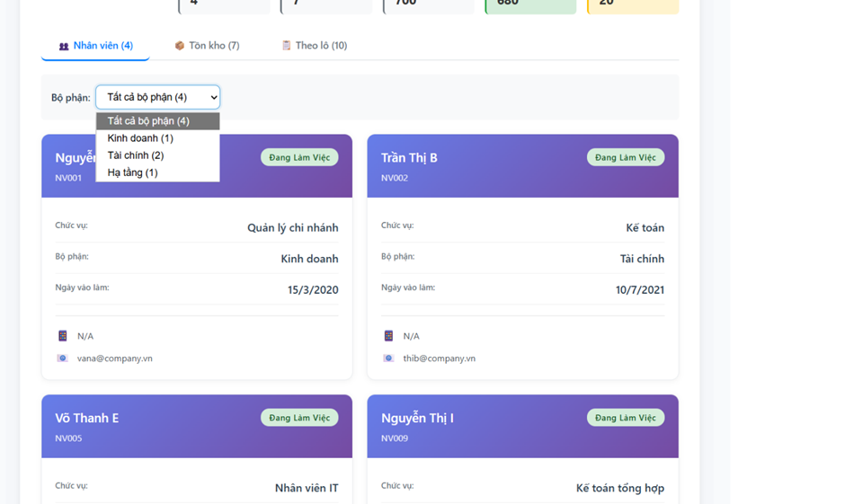

### Batch Management
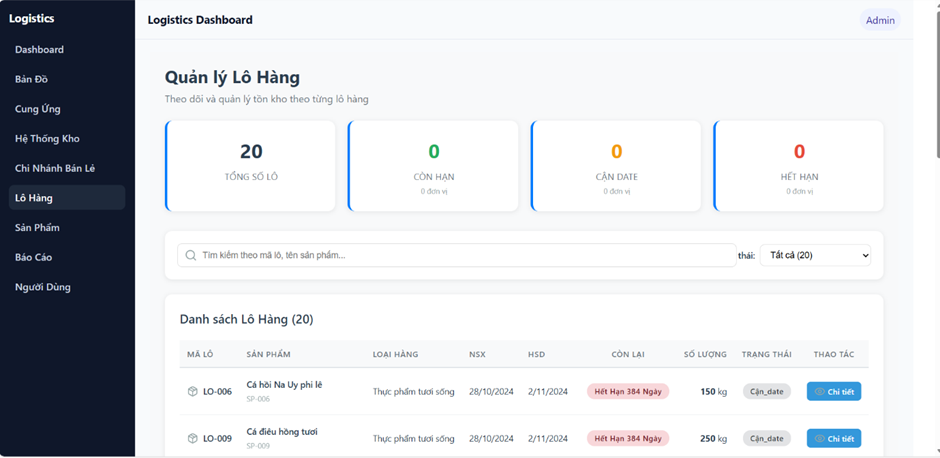
